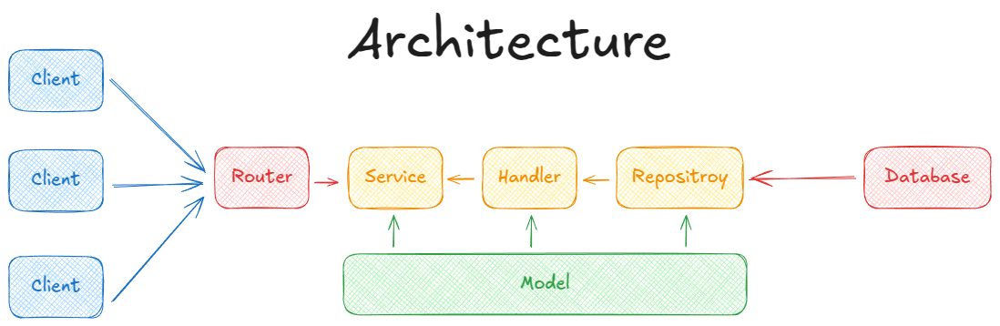
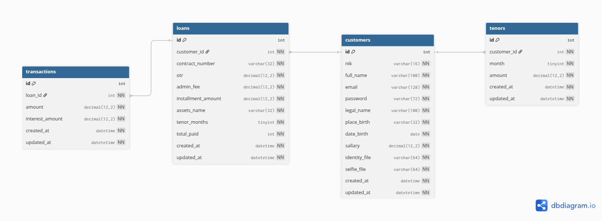

# Kredit Plus API

[](https://golang.org/)

A robust backend RESTful API service for "Kredit Plus", built with Go (Golang). This project is designed to handle credit application processing, user management, and other related financial operations. It is built using the high-performance [Fiber](https://gofiber.io/) web framework and follows modern best practices for structure, configuration, and deployment.

## ✨ Features

- **High-Performance REST API**: Built with Fiber, one of the fastest web frameworks for Go.
- **JWT Authentication**: Secure endpoints using JSON Web Tokens (`golang-jwt/jwt`).
- **ORM Integration**: Uses [GORM](https://gorm.io/) for elegant and efficient database interaction with a MySQL backend.
- **Configuration Management**: Environment-based configuration using `godotenv` and `caarlos0/env`.
- **Structured Logging**: Production-ready logging with `zerolog`.
- **Request Validation**: Automatic request payload validation using `go-playground/validator`.
- **API Documentation**: Auto-generated Swagger 2.0 documentation using `swaggo/swag`.
- **Containerized**: Fully containerized with Docker and Docker Compose for easy setup and deployment.
- **Developer Friendly**: A comprehensive `Makefile` for common tasks like building, running, linting, and cleaning.

## 🛠️ Tech Stack

| Category              | Technology / Library                                       |
| --------------------- | ---------------------------------------------------------- |
| **Language** | Go (Golang)                                                |
| **Web Framework** | [Fiber v2](https://github.com/gofiber/fiber)               |
| **Database** | [MySQL 8.0](https://www.mysql.com/)                        |
| **ORM** | [GORM](https://gorm.io/)                                   |
| **Authentication** | [JWT (golang-jwt/jwt/v5)](https://github.com/golang-jwt/jwt) |
| **API Documentation** | [Swagger (swaggo/swag)](https://github.com/swaggo/swag)    |
| **Logging** | [Zerolog](https://github.com/rs/zerolog)                   |
| **Validation** | [Validator v10](https://github.com/go-playground/validator)|
| **Configuration** | [go-dotenv](https://github.com/joho/godotenv), [env/v11](https://github.com/caarlos0/env) |
| **Containerization** | [Docker](https://www.docker.com/), [Docker Compose](https://docs.docker.com/compose/) |
| **Live Reload** | [Air](https://github.com/air-verse/air)                    |
| **Linting** | [golangci-lint](https://github.com/golangci/golangci-lint) |


## 🚀 Getting Started

Follow these instructions to get the project up and running on your local machine.

### Prerequisites

Make sure you have the following software installed:

- [Go](https://golang.org/dl/) >= 1.24
- [Docker](https://www.docker.com/get-started)
- [Docker Compose](https://docs.docker.com/compose/install/)
- [Make](https://www.gnu.org/software/make/)

### 1. Clone the Repository

```bash
git clone [https://github.com/ibnuzaman/kredit-plus](https://github.com/ibnuzaman/kredit-plus)
cd kredit-plus
```

### 2. Configure Environment Variables

Create a `.env` file in the root of the project by copying the example file.

```bash
cp .env.example .env
```

Now, open the `.env` file and fill in the required values.

```env
# Application Environment: development, staging, or production
ENV=development

# Server Configuration
PORT=8080
HOST=0.0.0.0

# Database Configuration
DB_HOST=localhost # Use 'db' if running with Docker Compose
DB_PORT=3306
DB_USER=root
DB_PASSWORD=your_strong_db_password
DB_NAME=kredit_plus_db

# JWT Configuration
JWT_SECRET_KEY=your_very_secret_jwt_key
JWT_EXPIRES_IN=24h
```

## 🏃 Running the Application

You can run the application in two ways: using Docker (recommended for consistency) or directly on your local machine using the Makefile.

### A. Using Docker (Recommended)

This is the simplest way to start the entire stack, including the database.

```bash
docker-compose up -d --build
```

The API will be available at `http://localhost:8080` (or the port you specified in `.env`).

To stop the services:
```bash
docker-compose down
```

### B. Using `make` (for Local Development)

If you prefer to run the application directly on your host machine.

1.  **Install development dependencies:**
    This command will install `air` for live-reloading, `golangci-lint` for linting, and `swag` for documentation.
    ```bash
    make dev/install
    ```
    
2.  **Setup Database:**
    -   Ensure you have a local MySQL instance running.
    -   Create a new database with the name you specified in your `.env` file (e.g., `kredit_plus`).
    -   Import the provided SQL dump to set up the tables and initial data:
    ```bash
    mysql -u your_user -p your_database_name < ./sql/kredit_plus.sql
    ```

3.  **Run with Live Reload:**
    This is ideal for development. It will automatically restart the server when you make changes to Go files.
    ```bash
    make dev
    ```

4.  **Run without Live Reload:**
    To simply build and run the application once:
    ```bash
    make run
    ```

## 📖 API Documentation

This project uses Swagger for API documentation. Once the application is running, you can access the interactive Swagger UI at:

**[http://localhost:8080/swagger/index.html](http://localhost:8080/swagger/index.html)**

*(Replace `8080` if you configured a different `PORT`)*

To regenerate the documentation after making changes to the controller annotations:
```bash
make docs
```

## ⚙️ Makefile Commands

A `Makefile` is included to streamline development. Here are the most common commands:

| Command           | Description                                                        |
| ----------------- | ------------------------------------------------------------------ |
| `make help`       | Displays a list of all available commands and their descriptions.  |
| `make tidy`       | Tidies go module files and formats all `.go` files.                |
| `make build`      | Builds the Go binary into the `/tmp/` directory.                   |
| `make run`        | Runs the application from the pre-built binary.                    |
| `make dev`        | Runs the application in development mode with live-reloading (`air`).|
| `make lint`       | Runs `go fmt`, `go vet`, and `golangci-lint` to analyze the code.  |
| `make docs`       | Generates the Swagger/OpenAPI documentation.                       |
| `make clean`      | Removes the build binary and coverage files.                       |
| `make dev/install`| Installs all Go-based development tools.                           |

## 📁 Project Structure

This project adopts a layered architecture to ensure a clean separation of concerns, making the codebase maintainable, scalable, and easy to test. The core logic is encapsulated within the `internal` package, a standard practice in modern Go applications.

```
.
├── main.go                     // Main application entry point. Initializes and starts the server.
│
├── internal/                   // Contains all core business logic, encapsulated to prevent external use.
│   ├── app.go                  // Initializes and wires up all internal components (services, repos, etc.).
│   ├── router.go               // Defines all API routes and maps them to their respective handlers.
│   │
│   ├── handler/                // Layer: HTTP handlers (controllers) that parse requests and call services.
│   │   ├── auth_handler.go
│   │   └── ...
│   │
│   ├── service/                // Layer: Business logic. Orchestrates operations and implements use cases.
│   │   ├── auth_service.go
│   │   └── ...
│   │
│   ├── repository/             // Layer: Data Access Layer (DAL). Interacts directly with the database.
│   │   ├── auth_repository.go
│   │   └── ...
│   │
│   ├── model/                  // Defines data structures, GORM models, and API request/response bodies.
│   │   ├── customers.go
│   │   └── ...
│   │
│   ├── middleware/             // Custom Fiber middleware, such as for JWT authentication.
│   │   └── authentication.go
│   │
│   └── util/                   // Utility functions specific to the internal logic (e.g., currency formatting).
│
├── config/                     // Manages loading application configuration from .env files.
├── database/                   // Handles the database (MySQL) connection setup.
├── logger/                     // Sets up the application-wide structured logger.
├── exception/                  // Defines standard API error/success response structures.
├── validation/                 // Implements custom request validation rules.
├── constant/                   // Stores application-wide constant values.
│
├── // --- Containerization & Tooling ---
├── Dockerfile                  // Instructions for building the production Docker image.
├── docker-compose.yml          // Defines services for local development (app + database).
├── Makefile                    // Automates common development tasks (build, run, lint).
├── go.mod                      // Manages the project's dependencies.
├── .air.toml                   // Configuration for live-reloading during development.
│
└── // --- Documentation & Environment ---
├── docs/                       // Contains auto-generated API documentation (Swagger).
├── .env.example                // Template for required environment variables.
└── README.md                   // This documentation file.
```

## 🏛️ Application Architecture

This project implements a **Layered Architecture** to ensure a clean separation of concerns. The flow is unidirectional, starting from the `Handler` which receives requests, passing to the `Service` for business logic execution, and finally to the `Repository` for data access, making the system modular and easy to maintain.

<p align="center">
  
</p>
<p align="center">
  <a href="https://excalidraw.com/#json=j8Uz2VXB_L1HY5-_wC0zm,pxo54F0vE1YYyxI7xI5MPA">View Live Architecture on Excalidraw</a>
</p>

## 🗄️ Database Design (ERD)

The database schema is designed to model the entire loan lifecycle, centered around four primary entities: `customers`, `tenors`, `loans`, and `transactions`. The relationships ensure data integrity and reflect the business logic accurately.

-   **Customers**: The central entity, storing all personal, credential, and financial information for each user.
-   **Tenors**: Uniquely defines the approved credit limit for each customer at different loan durations (e.g., 1 month, 3 months, etc.).
-   **Loans**: Represents an individual loan agreement taken by a customer, detailing the contract, asset, and total amount.
-   **Transactions**: Records every payment installment made towards a specific loan, tracking both principal and interest amounts.

<p align="center">
  
</p>
<p align="center">
  <a href="https://dbdiagram.io/d/BE-Kredit-Plus-686544cff413ba3508f1aced">View Live Schema on dbdiagram.io</a>
</p>

## 🏁 Conclusion

This project was developed not only to fulfill functional requirements but also to embody the principles of a production-ready, secure, and reliable system. The final application successfully demonstrates the following core capabilities:

-   **High Availability**: The application is designed for resilience. By being fully containerized with Docker and built on a high-performance Go (Fiber) stack, it can be easily deployed in a scalable and orchestrated environment to meet demanding uptime requirements.

-   **Proactive & Transparent Operations**: With integrated structured logging (`zerolog`) and a centralized exception handling mechanism, the system provides clear insights into errors, bugs, and performance metrics. This enables proactive monitoring and rapid troubleshooting.

-   **Rapid & Reliable Deployments**: Through a structured **Git Flow** workflow, containerization with `Dockerfile`, and build automation via `Makefile`, the project establishes a foundation for consistent and reliable deployments, ensuring new features and bug fixes can be shipped accurately.

-   **OWASP Top 10 Aligned Security**: The application is built with a strong focus on security, incorporating defenses against key risks from the **OWASP Top 10 (2021)**. Specific implementations are marked with `//? implement` in the code for review. Key areas covered include:
    -   **A01: Broken Access Control**
    -   **A02: Cryptographic Failures**
    -   **A03: Injection**
    -   **A04: Insecure Design**
    -   **A05: Security Misconfiguration**

-   **Guaranteed Data Integrity (ACID)**: The application ensures data consistency by leveraging database transactions for all critical operations. This guarantees that multi-step database writes adhere to **ACID principles** (Atomicity, Consistency, Isolation, Durability), preventing partial updates and data corruption.
